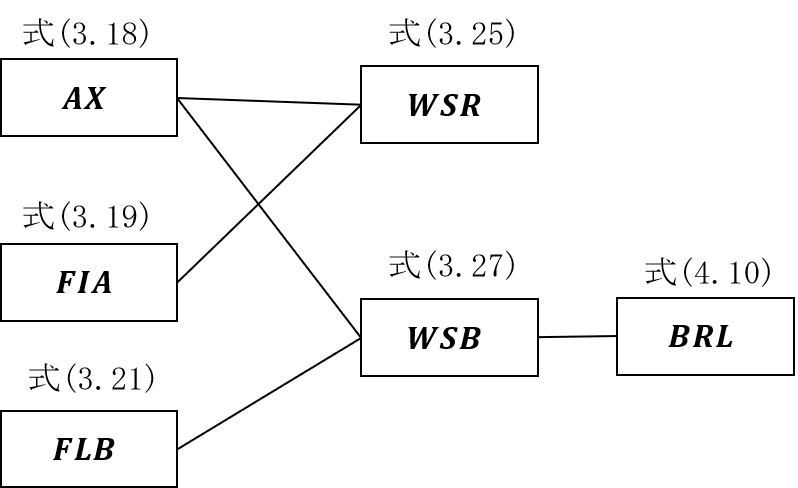
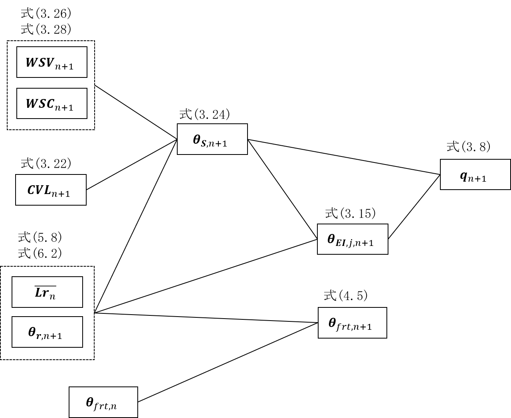

:stem: latexmath

=== 熱計算のバランス式

==== 1. 概要

室の温度バランス式を連立させて、次時刻の室の温度を計算する式を導出する。

==== 2. 記号説明

==== 3. 境界表面における熱収支

===== 1) 表面温度

ステップ stem:[n+1] における境界 stem:[j] の表面温度 stem:[\theta_{s,j,n+1}] は次式により表される。

[stem]
++++
\theta_{s,j,n+1}
= \phi_{A0,j} \cdot q_{j,n+1}
+ \sum_{m=1}^{M}{\theta'_{S,A,j,m,n+1}}
+ \phi_{T0,j} \cdot \theta_{rear,j,n+1}
+ \sum_{m=1}^{M}{\theta'_{S,T,j,m,n+1}}
\tag{3.1}
++++

[stem]
++++
\theta'_{S,A,j,m,n+1}
= q_{j,n} \cdot \phi_{A1,j,m}
+ r_{j,m} \cdot \theta'_{S,A,j,m,n}
\tag{3.2}
++++

[stem]
++++
\theta'_{S,T,j,m,n+1}
= \theta_{rear,j,n} \cdot \phi_{T1,j,m}
+ r_{j,m} \cdot \theta'_{S,T,j,m,n}
\tag{3.3}
++++

ここで、

stem:[\theta_{s,j,n}]： ステップ stem:[n] における境界 stem:[j] の表面温度, ℃

stem:[\phi_{A0,j}]： 境界 stem:[j] の吸熱応答係数の初項, m^2^K/W

stem:[\phi_{T0,j}]： 境界 stem:[j] の貫流応答係数の初項, -

stem:[q_{j,n}]: ステップ stem:[n] における境界 stem:[j] の表面熱流（壁体吸熱を正とする）, W/m^2^

stem:[\theta_{rear,j,n}]: ステップ stem:[n] における境界 stem:[j] の裏面温度, ℃

stem:[\theta'_{S,A,j,m,n}]: ステップ stem:[n] における境界 stem:[j] の項別公比法の指数項 stem:[m] の吸熱応答の項別成分, ℃

stem:[\theta'_{S,T,j,m,n}]: ステップ stem:[n] における境界 stem:[j] の項別公比法の指数項 stem:[m] の貫流応答の項別成分, ℃

stem:[\phi_{A1,j,m}]: 境界 stem:[j] の項別公比法の指数項 stem:[m] の吸熱応答係数, m^2^K/W

stem:[\phi_{T1,j,m}]: 境界 stem:[j] の項別公比法の指数項 stem:[m] の貫流応答係数, -

stem:[r_{j,m}]: 境界 stem:[j] の項別公比法の指数項 stem:[m] の公比, -

である。 stem:[M] は項別公比法の指数項の数である。

これらの式を境界 stem:[0] ～ stem:[J-1] でベクトル表記をすると、次式となる。

[stem]
++++
\boldsymbol{\theta}_{s,n+1}
= \boldsymbol{\phi}_{A0} \cdot \boldsymbol{q}_{n+1}
+ \sum_{m=1}^{M}{\boldsymbol{\theta'}_{S,A,m,n+1}}
+ \boldsymbol{\phi}_{T0} \cdot \boldsymbol{\theta}_{rear,n+1}
+ \sum_{m=1}^{M}{\boldsymbol{\theta'}_{S,T,m,n+1}}
\tag{3.4}
++++

[stem]
++++
\boldsymbol{\theta'}_{S,A,m,n+1}
= \boldsymbol{\phi}_{A1,m} \cdot \boldsymbol{q_{n}}
+ \boldsymbol{r_{m}} \cdot \boldsymbol{\theta'}_{S,A,m,n}
\tag{3.5}
++++

[stem]
++++
\boldsymbol{\theta'}_{S,T,m,n+1}
= \boldsymbol{\phi}_{T1,m} \cdot \boldsymbol{\theta_{rear,n}}
+ \boldsymbol{r}_{m} \cdot \boldsymbol{\theta'}_{S,T,m,n}
\tag{3.6}
++++

ここで、

stem:[\boldsymbol{\theta_{s,n}}]： ステップ stem:[n] における境界の表面温度, ℃

stem:[\begin{pmatrix}
\theta_{s,0,n} \\
\vdots \\
\theta_{s,J-1,n}
\end{pmatrix}]
で表されるベクトル。

stem:[\boldsymbol{\phi_{A0}}]： 境界の吸熱応答係数の初項, m^2^K/W

stem:[\begin{pmatrix}
  \phi_{A0,0} & \ldots & 0 \\
  \vdots & \ddots & \vdots\\
  0 & \ldots & \phi_{A0,J-1}
  \end{pmatrix}]
で表されるベクトル。

stem:[\boldsymbol{\phi_{T0}}]： 境界の貫流応答係数の初項, -

stem:[\begin{pmatrix}
  \phi_{T0,0} & \ldots & 0 \\
  \vdots & \ddots & \vdots\\
  0 & \ldots & \phi_{T0,J-1}
  \end{pmatrix}]
で表されるベクトル。

stem:[\boldsymbol{q_{n}}]: ステップ stem:[n] における境界の表面熱流（壁体吸熱を正とする）, W/m^2^

stem:[\begin{pmatrix}
  q_{0,n}\\
  \vdots\\
  q_{J-1,n}
\end{pmatrix}]
で表されるベクトル。

stem:[\boldsymbol{\theta_{rear,n}}]: ステップ stem:[n] における境界の裏面温度, ℃

stem:[\begin{pmatrix}
  \theta_{rear,0,n} \\
  \vdots \\
  \theta_{rear,J-1,n}
\end{pmatrix}]
で表されるベクトル。

stem:[\boldsymbol{\theta'_{S,A,m,n}}]: ステップ stem:[n] における境界の項別公比法の指数項 stem:[m] の吸熱応答の項別成分, ℃

stem:[\begin{pmatrix}
  \theta'_{S,A,0,m,n} \\
  \vdots \\
  \theta'_{S,A,J-1,m,n}
\end{pmatrix}]
で表されるベクトル。

stem:[\boldsymbol{\theta'_{S,T,m,n}}]: ステップ stem:[n] における境界の項別公比法の指数項 stem:[m] の貫流応答の項別成分, ℃

stem:[\begin{pmatrix}
  \theta'_{S,T,0,m,n} \\
  \vdots \\
  \theta'_{S,T,J-1,m,n}
\end{pmatrix}]
で表されるベクトル。

stem:[\boldsymbol{\phi_{A1,m}}]: 境界の項別公比法の指数項 stem:[m] の吸熱応答係数, m^2^K/W

stem:[\begin{pmatrix}
  \phi_{A1,0,m} & \ldots & 0\\
  \vdots & \ddots & \vdots\\
  0 & \ldots & \phi_{A1,J-1,m}
\end{pmatrix}]
で表されるベクトル。

stem:[\boldsymbol{\phi_{T1,j,m}}]: 境界の項別公比法の指数項 stem:[m] の貫流応答係数, -

stem:[\begin{pmatrix}
  \phi_{T1,0,m} & \ldots & 0\\
  \vdots & \ddots & \vdots\\
  0 & \ldots & \phi_{T1,J-1,m}
\end{pmatrix}]
で表されるベクトル。

stem:[\boldsymbol{r_{m}}]: 境界の項別公比法の指数項 stem:[m] の公比, -

stem:[\begin{pmatrix}
  r_{0,m} & \ldots & 0\\
  \vdots & \ddots & \vdots\\
  0 & \ldots & r_{J-1,m}
\end{pmatrix}]
で表されるベクトル。

である。

TIP: 例えば境界の吸熱応答係数の初項 stem:[\boldsymbol{\phi}_{A0}] は、
stem:[\begin{pmatrix}
  \phi_{A0,0} \\
  \vdots \\
  \phi_{A0,J-1}
\end{pmatrix}]
で表すべきであるが、後のベクトル計算の記述性・操作性を考え、予め対角化した行列、
stem:[\begin{pmatrix}
\phi_{A0,0} & \ldots & 0 \\
\vdots & \ddots & \vdots\\
0 & \ldots & \phi_{A0,J-1}
\end{pmatrix}]
として与える。なお、室温や日射量等の状態量を表す変数は、対角化せずに、[J×1]の行列で表す。

===== 2) 表面熱流

ステップ stem:[n] 及びステップ stem:[n+1] における境界 stem:[j] の表面熱流 stem:[q_{j,n}] 及び stem:[q_{j,n+1}] は次式により表される。

[stem]
++++
q_{j,n}
= h_{i,j} \cdot ( \theta_{EI,j,n} - \theta_{S,j,n} )
\tag{3.7}
++++

ここで、

stem:[h_{i,j}]： 境界 stem:[j] の室内側総合熱伝達率, W/m^2^K

stem:[\theta_{EI,j,n}]： ステップ stem:[n] における境界 stem:[j] の等価温度, ℃

である。

これらの式を境界 stem:[0] ～ stem:[J-1] でベクトル表記をすると、次式となる。

[stem]
++++
\boldsymbol{q}_{n}
= \boldsymbol{h}_{i} \cdot ( \boldsymbol{\theta}_{EI,n} - \boldsymbol{\theta}_{S,n} )
\tag{3.8}
++++

ここで、

stem:[\boldsymbol{h}_{i}]： 境界の室内側総合熱伝達率, W/m^2^K

stem:[\begin{pmatrix}
  h_{i,0} & \cdots & 0 \\
  \vdots & \ddots & \vdots \\
  0 & \cdots & h_{i,J-1}
\end{pmatrix}]
で表されるベクトル。

stem:[\boldsymbol{\theta}_{EI,n}]： ステップ stem:[n] における境界の等価温度, ℃

stem:[\begin{pmatrix}
  \theta_{EI,0,m} \\
  \vdots \\
  \theta_{EI,J-1,m}
\end{pmatrix}]
で表されるベクトル。

である。

===== 3) 等価温度

境界の表面における熱流を対流・放射・日射熱取得・放射暖房からの熱取得に分けて記述すると次式となる。

[stem]
++++
q_{j,n}
= h_{c,j} \cdot (\theta_{r,j,n} - \theta_{S,j,n})
+ h_{r,j} \cdot (MRT_{j,n} - \theta_{S,j,n})
+ RS_{j,n}
+ \frac{ flr_{j,i} \cdot Lr_{i,n} \cdot (1 - \beta_i) }{A_j}
\tag{3.9}
++++

ここで、

stem:[h_{c,j}]： 境界 stem:[j] の室内側対流熱伝達率, W/m^2^K

stem:[h_{r,j}]： 境界 stem:[j] の室内側放射熱伝達率, W/m^2^K

stem:[\theta_{r,j,n}]： ステップ stem:[n] における境界 stem:[j] が接する室の空気温度, ℃

stem:[MRT_{j,n}]： ステップ stem:[n] における境界 stem:[j] の平均放射温度, ℃

stem:[RS_{j,n}]： ステップ stem:[n] における境界 stem:[j] の透過日射吸収熱量, W/m^2^

stem:[flr_{j,i}]: 室 stem:[i] に設置された放射暖房の放熱量のうち放射成分に対する境界 stem:[j] の室内側表面の吸収比率, -

stem:[Lr_{i,n}]: ステップ stem:[n] における室 stem:[i] に設置された放射暖房の放熱量, W

stem:[\beta_{i}]: 室 stem:[i] に設置された放射暖房の対流成分比率, -

stem:[A_{j}]: 境界 stem:[j] の面積, m^2^

である。この境界表面における熱流は次式のように表されるため、

[stem]
++++
q_{j,n} = h_{i,j} \cdot ( \theta_{EI,j,n} - \theta_{S,j,n} ) \tag{再掲 3.7}
++++

ステップ stem:[n] における境界 stem:[j] の等価温度 stem:[\theta_{EI,j,n}] は次式のように表される。

[stem]
++++
\theta_{EI,j,n}
= \frac{h_{c,j}}{h_{i,j}} \cdot \theta_{r,j,n}
+ \frac{h_{r,j}}{h_{i,j}} \cdot MRT_{j,n}
+ \frac{RS_{j,n}}{h_{i,j}}
+ \frac{flr_{j,i} \cdot Lr_{i,n} \cdot (1 - \beta_i) }{A_j \cdot h_{i,j}}
\tag{3.10}
++++

となる。

これらの式を境界 stem:[0] ～ stem:[J-1] でベクトル表記をすると、次式となる。

[stem]
++++
\boldsymbol{\theta}_{EI,n}
= \boldsymbol{h}_{i}^{-1} \cdot
( \boldsymbol{h}_{c} \cdot \boldsymbol{p} \cdot \boldsymbol{\theta_{r,n}}
+ \boldsymbol{h}_{r} \cdot \boldsymbol{MRT}_{n}
+ \boldsymbol{RS}_{n}
+ \boldsymbol{A}^{-1} \cdot (1 - \boldsymbol{\beta}) \cdot \boldsymbol{flr} \cdot \boldsymbol{Lr}_{n}
)
\tag{3.11}
++++

ここで、

stem:[\boldsymbol{h}_{c}]： 境界の室内側対流熱伝達率, W/m^2^K

stem:[\begin{pmatrix}
  h_{c,0} & \cdots & 0\\
  \vdots & \ddots & \vdots \\
  0 & \cdots & h_{c,J-1}
\end{pmatrix}]
で表されるベクトル。

stem:[\boldsymbol{h}_{r}]： 境界の室内側放射熱伝達率, W/m^2^K

stem:[\begin{pmatrix}
  h_{r,0} & \cdots & 0\\
  \vdots & \ddots & \vdots \\
  0 & \cdots & h_{r,J-1}
\end{pmatrix}]
で表されるベクトル。

stem:[\boldsymbol{p}]: 境界と室の関係を表す係数（境界の室内側が室に接していれば1とし、それ以外は0とする。）

stem:[\begin{pmatrix}
  p_{0,0} & \ldots & p_{0,I-1} \\
  \vdots & \ddots & \vdots \\
  p_{J-1,0} & \ldots & p_{J-1,I-1}
\end{pmatrix}]
で表されるベクトル。

stem:[\boldsymbol{\theta}_{r,n}]： ステップ stem:[n] における室の空気温度, ℃

stem:[\begin{pmatrix}
  \theta_{r,0} \\
  \vdots \\
  \theta_{r,I-1}
\end{pmatrix}]
で表されるベクトル。

stem:[\boldsymbol{MRT}_{n}]： ステップ stem:[n] における境界の平均放射温度, ℃

stem:[\begin{pmatrix}
  MRT_{0} \\
  \vdots \\
  MRT_{J-1}
\end{pmatrix}]
で表されるベクトル。

stem:[\boldsymbol{RS}_{n}]： ステップ stem:[n] における境界の透過日射吸収熱量, W/m^2^

stem:[\begin{pmatrix}
  RS_{0} \\
  \vdots \\
  RS_{J-1}
\end{pmatrix}]
で表されるベクトル。

stem:[\boldsymbol{flr}]: 室に設置された放射暖房の放熱量のうち放射成分に対する境界の室内側表面の吸収比率, -

stem:[\begin{pmatrix}
  flr_{0,0} & \ldots & flr_{0,I-1} \\
  \vdots & \ddots & \vdots \\
  flr_{J-1,0} & \ldots & flr_{J-1,I-1}
\end{pmatrix}]
で表されるベクトル。

stem:[\boldsymbol{Lr}_{n}]: ステップ stem:[n] における室に設置された放射暖房の放熱量, W

stem:[\begin{pmatrix}
  Lr_{0} \\
  \vdots \\
  Lr_{I-1}
\end{pmatrix}]
で表されるベクトル。

stem:[\boldsymbol{\beta}]: 室に設置された放射暖房の対流成分比率, -

stem:[\begin{pmatrix}
  \beta_{0} & \ldots & 0 \\
  \vdots & \ddots & \vdots \\
  0 & \ldots & \beta_{I-1}
\end{pmatrix}]
で表されるベクトル。

stem:[\boldsymbol{A}]: 境界の面積, m^2^

stem:[\begin{pmatrix}
  A_{0} & \ldots & 0 \\
  \vdots & \ddots & \vdots \\
  0 & \ldots & A_{I-1}
\end{pmatrix}]
で表されるベクトル。

である。

ここで、ステップ stem:[n] における境界 stem:[j] が接する室の空気温度は、

[stem]
++++
　\begin{pmatrix}
  \theta_{r,0,n} \\
  \vdots \\
  \theta_{r,J-1,n}
\end{pmatrix} =
\begin{pmatrix}
  p_{0,0} & \ldots & p_{0,I-1} \\
  \vdots & \ddots & \vdots \\
  p_{J-1,0} & \ldots & p_{J-1,I-1}
\end{pmatrix} \cdot
\begin{pmatrix}
  \theta_{r,0} \\
  \vdots \\
  \theta_{r,I-1}
\end{pmatrix} =
\boldsymbol{p} \cdot \boldsymbol{\theta_r}
++++

の関係を用いて、[I×1]の要素を[J×1]の要素に変換している。

===== 4) 裏面温度

裏面温度とは、境界の種類によって、

* 外気温度の場合
* 外気温度と室内温度を按分する場合（温度差係数が1ではない場合）
* 隣室の温度の場合

が考えられるため、一般化して次式のように定義する。

[stem]
++++
\theta_{rear,j,n} =
\begin{pmatrix}
  k'_{EI,j,0} & \ldots & k'_{EI,j,J-1}
\end{pmatrix} \cdot
\begin{pmatrix}
  \theta_{EI,0,n} \\
  \vdots \\
  \theta_{EI,J-1,n}
\end{pmatrix} +
k_{EO,j} \cdot \theta_{EO,n}
\tag{3.12}
++++

ここで、

stem:[k'_{EI,j,j^*}]： 境界 stem:[j] の裏面温度に境界　stem:[j^*] の等価温度が与える影響

stem:[k_{EO,j}]: 境界 stem:[j] の裏面温度に屋外側等価温度が与える影響

stem:[\theta_{EO,n}]: ステップ stem:[n] における屋外側等価温度, ℃

である。

例えば、外気温度の場合は、 stem:[k'_{EI,j,0}] ～ stem:[k'_{EI,j,J-1}] は0.0, stem:[k_{EO,j}] は1.0である。

外気温度と室内温度を按分する場合の例として例えば床下の場合は温度差係数0.7が採用されるが、その場合の床下に面する境界の裏面（床下側）温度に等価温度として与える境界を stem:[j^*] とすると、 stem:[k'_{EI,j,j^*}] は 0.3、stem:[k'_{EO,j}] は0.7である。

間仕切り等、裏面が室の場合は、stem:[k'_{EI,j,0}] ～ stem:[k'_{EI,j,J-1}] のどれかが1.0, stem:[k_{EO,j}] は0.0である。

これらの式を境界 stem:[0] ～ stem:[J-1] でベクトル表記をすると、次式となる。

[stem]
++++
\boldsymbol{\theta}_{rear,n}
= \boldsymbol{k'}_{EI} \cdot \boldsymbol{\theta}_{EI,n}
+ \boldsymbol{k}_{EO} \cdot \theta_{EO,n}
\tag{3.13}
++++

ここで、

stem:[\boldsymbol{k'}_{EI,j,j^*}]： 境界 stem:[j] の裏面温度に境界　stem:[j^*] の等価温度が与える影響

stem:[\begin{pmatrix}
  k'_{EI,0,0} & \ldots & k'_{EI,0,j^*} & \ldots & k'_{EI,0,J-1} \\
  \vdots & \ddots & \vdots & & \vdots \\
  k'_{EI,j,0} & \ldots & k'_{EI,j,j^*} & \ldots & k'_{EI,j,J-1} \\
  \vdots & & \vdots & \ddots & \vdots \\
  k'_{EI,J-1,0} & \ldots & k'_{EI,J-1,j^*} & \ldots & k'_{EI,J-1,J-1} \\
\end{pmatrix}]
で表されるベクトル。

stem:[\boldsymbol{k}_{EO}]: 境界の裏面温度に屋外側等価温度が与える影響

stem:[\begin{pmatrix}
  k_{EO,0} \\
  \vdots \\
  k_{EO,J-1}
\end{pmatrix}]
で表されるベクトル。

である。

===== 4) 平均放射温度と放射熱伝達率

ステップ stem:[n] における境界 stem:[j] の等価温度 stem:[\theta_{EI,j,n}] を求めるにあたり、放射のやりとりは、

[stem]
++++
h_{r,j} \cdot MRT_{j,n}
++++

で表されるが、ここで、 stem:[MRT_{j,n}] を室 stem:[i] の微小球の温度で代表させると、平均放射温度 stem:[MRT] は室 stem:[i] ごとに定められ、

[stem]
++++
MRT_{i,n}
= \sum_{j=0}^{J-1}{F_{mrt,i,j}} \cdot \theta_{S,j,n}
\tag{3.14}
++++

となる。ここで、

stem:[F_{mrt,i,j}]: 境界 stem:[j] の室 stem:[i] の微小球に対する形態係数

である。放射熱伝達率についても微小球に対するものとして再定義される。この放射のやりとりをベクトル表記すると、

[stem]
++++
\boldsymbol{h}_r \cdot \boldsymbol{p} \cdot \boldsymbol{F}_{mrt} \cdot \boldsymbol{\theta}_{S,n}
++++

となる。ここで、

stem:[\boldsymbol{F}_{mrt}]: 境界の室の微小球に対する形態係数

stem:[\begin{pmatrix}
  F_{mrt,0,0} & \ldots & F_{mrt,0,J-1} \\
  \vdots & \ddots & \vdots & \\
  F_{mrt,I-1,0} & \ldots & F_{mrt,I-1,J-1}
\end{pmatrix}]
で表されるベクトル。

である。この関係を式(1.11)に代入すると、

[stem]
++++
\boldsymbol{\theta}_{EI,n} = \boldsymbol{h}_{i}^{-1} \cdot
( \boldsymbol{h}_{c} \cdot \boldsymbol{p} \cdot \boldsymbol{\theta_{r,n}}
+ \boldsymbol{h}_{r} \cdot \boldsymbol{p} \cdot \boldsymbol{F}_{mrt} \cdot \boldsymbol{\theta}_{S,n}
+ \boldsymbol{RS}_{n}
+ \boldsymbol{A}^{-1} \cdot (1 - \boldsymbol{\beta}) \cdot \boldsymbol{flr} \cdot \boldsymbol{Lr}_{n}
) \tag{3.15}
++++

となる。

===== 5) 表面温度の関係式の整理

これまで整理した式、

[stem]
++++
\boldsymbol{\theta}_{s,n+1}
= \boldsymbol{\phi}_{A0} \cdot \boldsymbol{q}_{n+1}
+ \sum_{m=1}^{M}{\boldsymbol{\theta'}_{S,A,m,n+1}}
+ \boldsymbol{\phi}_{T0} \cdot \boldsymbol{\theta}_{rear,n+1}
+ \sum_{m=1}^{M}{\boldsymbol{\theta'}_{S,T,m,n+1}}
\tag{再掲3.4}
++++

[stem]
++++
\boldsymbol{q}_{n}
= \boldsymbol{h}_{i} \cdot ( \boldsymbol{\theta}_{EI,n} - \boldsymbol{\theta}_{S,n} )
\tag{再掲3.8}
++++

[stem]
++++
\boldsymbol{\theta}_{rear,n}
= \boldsymbol{k'}_{EI} \cdot \boldsymbol{\theta}_{EI,n}
+ \boldsymbol{k}_{EO} \cdot \theta_{EO,n}
\tag{再掲3.13}
++++

[stem]
++++
\boldsymbol{\theta}_{EI,n} = \boldsymbol{h}_{i}^{-1} \cdot
( \boldsymbol{h}_{c} \cdot \boldsymbol{p} \cdot \boldsymbol{\theta_{r,n}}
+ \boldsymbol{h}_{r} \cdot \boldsymbol{p} \cdot \boldsymbol{F}_{mrt} \cdot \boldsymbol{\theta}_{S,n}
+ \boldsymbol{RS}_{n}
+ \boldsymbol{A}^{-1} \cdot (1 - \boldsymbol{\beta}) \cdot \boldsymbol{flr} \cdot \boldsymbol{Lr}_{n}
) \tag{再掲3.15}
++++

について、順次代入すると、

[stem]
++++
\begin{align}
\boldsymbol{\theta}_{s,n+1} &= \boldsymbol{\phi}_{A0} \cdot \boldsymbol{q}_{n+1} + \sum_{m=1}^{M}{\boldsymbol{\theta'}_{S,A,m,n+1}} + \boldsymbol{\phi}_{T0} \cdot \boldsymbol{\theta}_{rear,n+1} + \sum_{m=1}^{M}{\boldsymbol{\theta'}_{S,T,m,n+1}} \\
&= \boldsymbol{\phi}_{A0} \cdot \boldsymbol{h}_{i} \cdot ( \boldsymbol{\theta}_{EI,n+1} - \boldsymbol{\theta}_{S,n+1} ) \\
&+ \boldsymbol{\phi}_{T0} \cdot (\boldsymbol{k'}_{EI} \cdot \boldsymbol{\theta}_{EI,n+1} + \boldsymbol{k}_{EO} \cdot \theta_{EO,n+1}) \\
&+ \sum_{m=1}^{M}{\boldsymbol{\theta'}_{S,A,m,n+1}} + \sum_{m=1}^{M}{\boldsymbol{\theta'}_{S,T,m,n+1}} \\

&= \boldsymbol{\phi}_{A0} \cdot \boldsymbol{h}_{i} \\
&\cdot \boldsymbol{h}_{i}^{-1} \cdot (\boldsymbol{h}_{c} \cdot \boldsymbol{p} \cdot \boldsymbol{\theta_{r,n+1}} + \boldsymbol{h}_{r} \cdot \boldsymbol{p} \cdot \boldsymbol{F}_{mrt} \cdot \boldsymbol{\theta}_{S,n+1} + \boldsymbol{RS}_{n+1} + \boldsymbol{A}^{-1} \cdot (1 - \boldsymbol{\beta}) \cdot \boldsymbol{flr} \cdot \boldsymbol{Lr}_{n+1}) \\
&- \boldsymbol{\phi}_{A0} \cdot \boldsymbol{h}_{i} \cdot \boldsymbol{\theta}_{S,n+1} \\
&+ \boldsymbol{\phi}_{T0} \cdot \boldsymbol{k'}_{EI} \\
&\cdot \boldsymbol{h}_{i}^{-1} \cdot (\boldsymbol{h}_{c} \cdot \boldsymbol{p} \cdot \boldsymbol{\theta_{r,n+1}} + \boldsymbol{h}_{r} \cdot \boldsymbol{p} \cdot \boldsymbol{F}_{mrt} \cdot \boldsymbol{\theta}_{S,n+1} + \boldsymbol{RS}_{n+1} + \boldsymbol{A}^{-1} \cdot (1 - \boldsymbol{\beta}) \cdot \boldsymbol{flr} \cdot \boldsymbol{Lr}_{n+1}) \\
&+ \boldsymbol{\phi}_{T0} \cdot \boldsymbol{k}_{EO} \cdot \theta_{EO,n+1} \\
&+ \sum_{m=1}^{M}{\boldsymbol{\theta'}_{S,A,m,n+1}} + \sum_{m=1}^{M}{\boldsymbol{\theta'}_{S,T,m,n+1}} \\

&= \boldsymbol{\phi}_{A0} \cdot \boldsymbol{h}_{c} \cdot \boldsymbol{p} \cdot \boldsymbol{\theta}_{r,n+1} \\
&+ \boldsymbol{\phi}_{A0} \cdot \boldsymbol{h}_{r} \cdot \boldsymbol{p} \cdot \boldsymbol{F}_{mrt} \cdot \boldsymbol{\theta}_{S,n+1} \\
&+ \boldsymbol{\phi}_{A0} \cdot \boldsymbol{RS}_{n+1} \\
&+ \boldsymbol{\phi}_{A0} \cdot \boldsymbol{A}^{-1} \cdot (1 - \boldsymbol{\beta}) \cdot \boldsymbol{flr} \cdot \boldsymbol{Lr}_{n+1} \\
&- \boldsymbol{\phi}_{A0} \cdot \boldsymbol{h}_{i} \cdot \boldsymbol{\theta}_{S,n+1} \\
&+ \boldsymbol{\phi}_{T0} \cdot \boldsymbol{k'}_{EI} \cdot \boldsymbol{h}_{i}^{-1} \cdot \boldsymbol{h}_{c} \cdot \boldsymbol{p} \cdot \boldsymbol{\theta_{r,n+1}} \\
&+ \boldsymbol{\phi}_{T0} \cdot \boldsymbol{k'}_{EI} \cdot \boldsymbol{h}_{i}^{-1} \cdot \boldsymbol{h}_{r} \cdot \boldsymbol{p} \cdot \boldsymbol{F}_{mrt} \cdot \boldsymbol{\theta}_{S,n+1} \\
&+ \boldsymbol{\phi}_{T0} \cdot \boldsymbol{k'}_{EI} \cdot \boldsymbol{h}_{i}^{-1} \cdot \boldsymbol{RS}_{n+1} \\
&+ \boldsymbol{\phi}_{T0} \cdot \boldsymbol{k'}_{EI} \cdot \boldsymbol{A}^{-1} \cdot \boldsymbol{h}_{i}^{-1} \cdot (1 - \boldsymbol{\beta}) \cdot \boldsymbol{flr} \cdot \boldsymbol{Lr}_{n+1} \\
&+ \boldsymbol{\phi}_{T0} \cdot \boldsymbol{k}_{EO} \cdot \theta_{EO,n+1} \\
&+ \sum_{m=1}^{M}{\boldsymbol{\theta'}_{S,A,m,n+1}} + \sum_{m=1}^{M}{\boldsymbol{\theta'}_{S,T,m,n+1}} \\
\end{align}
\tag{3.16}
++++

となる。 stem:[\boldsymbol{\theta}_{S,n+1}]に関係する項を左辺に移動させると、

[stem]
++++
\begin{align}
&\boldsymbol{\theta}_{s,n+1}
- \boldsymbol{\phi}_{A0} \cdot \boldsymbol{h}_{r} \cdot \boldsymbol{p} \cdot \boldsymbol{F}_{mrt} \cdot \boldsymbol{\theta}_{S,n+1}
+ \boldsymbol{\phi}_{A0} \cdot \boldsymbol{h}_{i} \cdot \boldsymbol{\theta}_{S,n+1}
- \boldsymbol{\phi}_{T0} \cdot \boldsymbol{k'}_{EI} \cdot \boldsymbol{h}_{i}^{-1} \cdot \boldsymbol{h}_{r} \cdot \boldsymbol{p} \cdot \boldsymbol{F}_{mrt} \cdot \boldsymbol{\theta}_{S,n+1}\\
&= (\boldsymbol{I} - \boldsymbol{\phi}_{A0} \cdot \boldsymbol{h}_{r} \cdot \boldsymbol{p} \cdot \boldsymbol{F}_{mrt} + \boldsymbol{\phi}_{A0} \cdot \boldsymbol{h}_{i} - \boldsymbol{\phi}_{T0} \cdot \boldsymbol{h}_{i}^{-1} \cdot \boldsymbol{h}_{r} \cdot \boldsymbol{k'}_{EI} \cdot \boldsymbol{p} \cdot \boldsymbol{F}_{mrt} ) \cdot \boldsymbol{\theta}_{S,n+1} \\
&= \boldsymbol{\phi}_{A0} \cdot \boldsymbol{h}_{c} \cdot \boldsymbol{p} \cdot \boldsymbol{\theta}_{r,n+1}
+ \boldsymbol{\phi}_{T0} \cdot \boldsymbol{k'}_{EI} \cdot \boldsymbol{h}_{i}^{-1} \cdot \boldsymbol{h}_{c} \cdot \boldsymbol{p} \cdot \boldsymbol{\theta_{r,n+1}} \\
&+ \boldsymbol{\phi}_{A0} \cdot \boldsymbol{RS}_{n+1}
+ \boldsymbol{\phi}_{T0} \cdot \boldsymbol{k'}_{EI} \cdot \boldsymbol{h}_{i}^{-1} \cdot \boldsymbol{RS}_{n+1}
+ \boldsymbol{\phi}_{T0} \cdot \boldsymbol{k}_{EO} \cdot \theta_{EO,n+1} \\
&+ \boldsymbol{\phi}_{A0} \cdot \boldsymbol{A}^{-1} \cdot (1 - \boldsymbol{\beta}) \cdot \boldsymbol{flr} \cdot \boldsymbol{Lr}_{n+1}
+ \boldsymbol{\phi}_{T0} \cdot \boldsymbol{k'}_{EI} \cdot \boldsymbol{A}^{-1} \cdot \boldsymbol{h}_{i}^{-1} \cdot (1 - \boldsymbol{\beta}) \cdot \boldsymbol{flr} \cdot \boldsymbol{Lr}_{n+1} \\
&+ \sum_{m=1}^{M}{\boldsymbol{\theta'}_{S,A,m,n+1}} + \sum_{m=1}^{M}{\boldsymbol{\theta'}_{S,T,m,n+1}} \\
\end{align}
\tag{3.17}
++++

となる。

ここで、

[stem]
++++
\boldsymbol{AX}
= \boldsymbol{I}
+ \boldsymbol{\phi}_{A0} \cdot \boldsymbol{h}_{i}
- \boldsymbol{\phi}_{A0} \cdot \boldsymbol{h}_{r} \cdot \boldsymbol{p} \cdot \boldsymbol{F}_{mrt}
- \boldsymbol{\phi}_{T0} \cdot \boldsymbol{h}_{i}^{-1} \cdot \boldsymbol{h}_{r} \cdot \boldsymbol{k'}_{EI} \cdot \boldsymbol{p} \cdot \boldsymbol{F}_{mrt}
\tag{3.18}
++++

[stem]
++++
\boldsymbol{FIA}
= (
\boldsymbol{\phi}_{A0} \cdot \boldsymbol{h}_{c}
+ \boldsymbol{\phi}_{T0} \cdot \boldsymbol{k'}_{EI} \cdot \boldsymbol{h}_{i}^{-1} \cdot \boldsymbol{h}_{c}
)
\cdot \boldsymbol{p}
\tag{3.19}
++++

[stem]
++++
\boldsymbol{CRX}_{n+1}
= \boldsymbol{\phi}_{A0} \cdot \boldsymbol{RS}_{n+1}
+ \boldsymbol{\phi}_{T0} \cdot \boldsymbol{k'}_{EI} \cdot \boldsymbol{h}_{i}^{-1} \cdot \boldsymbol{RS}_{n+1}
+ \boldsymbol{\phi}_{T0} \cdot \boldsymbol{k}_{EO} \cdot \theta_{EO,n+1}
\tag{3.20}
++++

[stem]
++++
\boldsymbol{FLB}
= (
\boldsymbol{\phi}_{A0} \cdot \boldsymbol{A}^{-1}
+ \boldsymbol{\phi}_{T0} \cdot \boldsymbol{k'}_{EI} \cdot \boldsymbol{A}^{-1} \cdot \boldsymbol{h}_{i}^{-1}
)
\cdot (1 - \boldsymbol{\beta})
\cdot \boldsymbol{flr}
\tag{3.21}
++++

[stem]
++++
\boldsymbol{CVL}_{n+1}
= \sum_{m=1}^{M}{\boldsymbol{\theta'}_{S,A,m,n+1}} + \sum_{m=1}^{M}{\boldsymbol{\theta'}_{S,T,m,n+1}}
\tag{3.22}
++++

とおくと、式(3.17)は次式のように表すことができる。

[stem]
++++
\boldsymbol{AX} \cdot \boldsymbol{\theta}_{S,n+1}
= \boldsymbol{FIA} \cdot \boldsymbol{\theta}_{r,n+1}
+ \boldsymbol{CRX}_{n+1}
+ \boldsymbol{FLB} \cdot \boldsymbol{LR}_{n+1}
+ \boldsymbol{CVL}_{n+1}
\tag{3.23}
++++

この式の各項に左から stem:[\boldsymbol{AX}] の逆行列をかけて、次のように式変形する。

[stem]
++++
\begin{align}
\boldsymbol{\theta}_{S,n+1}
&= \boldsymbol{AX}^{-1} \cdot \boldsymbol{FIA} \cdot \boldsymbol{\theta}_{r,n+1}
+ \boldsymbol{AX}^{-1} \cdot \boldsymbol{CRX}_{n+1}
+ \boldsymbol{AX}^{-1} \cdot \boldsymbol{FLB} \cdot \boldsymbol{LR}_{n+1}
+ \boldsymbol{AX}^{-1} \cdot \boldsymbol{CVL}_{n+1} \\
&= \boldsymbol{WSR} \cdot \boldsymbol{\theta}_{r,n+1}
+ \boldsymbol{WSC}_{n+1}
+ \boldsymbol{WSB} \cdot \boldsymbol{LR}_{n+1}
+ \boldsymbol{WSV}_{n+1}
\end{align}
\tag{3.24}
++++

ここで、

[stem]
++++
\boldsymbol{WSR}
= \boldsymbol{AX}^{-1} \cdot \boldsymbol{FIA}
\tag{3.25}
++++

[stem]
++++
\boldsymbol{WSC}_{n+1}
= \boldsymbol{AX}^{-1} \cdot \boldsymbol{CRX}_{n+1}
\tag{3.26}
++++

[stem]
++++
\boldsymbol{WSB}
= \boldsymbol{AX}^{-1} \cdot \boldsymbol{FLB}
\tag{3.27}
++++

[stem]
++++
\boldsymbol{WSV}_{n+1}
= \boldsymbol{AX}^{-1} \cdot \boldsymbol{CVL}_{n+1}
\tag{3.28}
++++

とした。

==== 4. 室の熱収支

===== 1) 室の熱収支

室の熱収支は次のように表される。

[stem]
++++
\begin{align}
\boldsymbol{C}_{rm} \cdot \frac{d \boldsymbol{\theta}_{r,n}}{d t}
&= \boldsymbol{p}^{T} \cdot \boldsymbol{h}_c \cdot \boldsymbol{A} \cdot (\boldsymbol{\theta}_{S,n} - \boldsymbol{p} \cdot \boldsymbol{\theta}_{r,n})
+ c_a \cdot \rho_a \cdot \boldsymbol{V}_n \cdot (\boldsymbol{\theta}_{o,n} - \boldsymbol{\theta}_{r,n})
+ c_a \cdot \rho_a \cdot \boldsymbol{V}_{nxt,n} \cdot \boldsymbol{\theta}_{r,n} \\
&+ \boldsymbol{H}_n
+ (\boldsymbol{LC}_n + \boldsymbol{\beta} \cdot \boldsymbol{Lr}_n)
+ \boldsymbol{G}_{frt} \cdot (\boldsymbol{\theta}_{frt,n} - \boldsymbol{\theta}_{r,n})
\end{align}
\tag{4.1}
++++

ここで、

stem:[\boldsymbol{C}_{rm}]: 室の空気と室に設置される家具の合計熱容量, J/K

stem:[\begin{pmatrix}
  C_{rm,0} & \ldots & 0 \\
  \vdots & \ddots & \vdots & \\
  0 & \ldots & C_{rm,I-1}
\end{pmatrix}]
で表されるベクトル。

stem:[t]: 時刻, s

stem:[c_a]: 空気の比熱, J/kg K

stem:[\rho_a]: 空気の密度, kg/m^3^

stem:[\boldsymbol{V_n}]: ステップ stem:[n] における換気・すきま風・自然風の利用による外気の流入量, m^3^/s

stem:[\begin{pmatrix}
  V_{0,n} & \ldots & 0 \\
  \vdots & \ddots & \vdots & \\
  0 & \ldots & V_{I-1,n}
\end{pmatrix}]
で表されるベクトル。

stem:[\boldsymbol{V_{nxt,n}}]: ステップ stem:[n] における室間の空気移動量, m^3^/s

stem:[\begin{pmatrix}
  V_{nxt,0,0,n}   & \ldots & V_{nxt,0,i^*,n}   & \ldots & V_{nxt,0,I-1,n} \\
  \vdots          & \ddots & \vdots            &        & \vdots \\
  V_{nxt,i,0,n}   & \ldots & V_{nxt,i,i^*,n}   & \ldots & V_{nxt,i,I-1,n} \\
  \vdots          &        & \vdots            & \ddots & \vdots \\
  V_{nxt,I-1,n}   & \ldots & V_{nxt,I-1,i^*,n} & \ldots & V_{nxt,I-1,I-1,n}
\end{pmatrix}]
で表されるベクトル。

ここで、stem:[i] は流入先の室番号を表し、 stem:[i^*] は流出元の室番号を表す。

stem:[\boldsymbol{H}_n]: ステップ stem:[n] における室内発熱, W

stem:[\begin{pmatrix}
  H_{0,n} \\
  \vdots  \\
  H_{I-1,n}
\end{pmatrix}]
で表されるベクトル。

stem:[\boldsymbol{Lc}_n]: ステップ stem:[n] における室に設置された対流暖房の放熱量, W

stem:[\begin{pmatrix}
  Lc_{0,n} \\
  \vdots  \\
  Lc_{I-1,n}
\end{pmatrix}]
で表されるベクトル。

stem:[\boldsymbol{G}_{frt}]: 室における家具と空気間の熱コンダクタンス, W/K

stem:[\begin{pmatrix}
  G_{frt,0} & \ldots & 0 \\
  \vdots & \ddots & \vdots & \\
  0 & \ldots & G_{frt,I-1}
\end{pmatrix}]
で表されるベクトル。

stem:[\boldsymbol{\theta}_{fun,n}]: ステップ stem:[n] における室に設置された家具の温度, ℃

stem:[\begin{pmatrix}
  \theta_{fun,0,n} \\
  \vdots  \\
  \theta_{fun,I-1,n}
\end{pmatrix}]
で表されるベクトル。

両辺をステップ stem:[n] から stem:[n+1] まで積分すると左辺は、

[stem]
++++
\left. \frac{d \boldsymbol{\theta}_r}{dt} \right|_n
= \frac{\boldsymbol{\theta}_{r,n} - \boldsymbol{\theta}_{r,n-1}}{\Delta t}
++++

のようになり、右辺は　stem:[n] から stem:[n+1] までの平均値（本来であれば積算値であるが、全体を stem:[\Delta n] で除しているので平均値）となるが、
平均値が計算できない温度の項についてはステップ stem:[n+1] の瞬時値で代表させる（後退差分）こととする。
換気量・放熱量については stem:[n] から stem:[n+1] までの平均値として定義し、瞬時値と区別するために以後の式展開では記号の上側にバーを付すこととする。

室の熱収支は次式となる。

[stem]
++++
\begin{align}
&\boldsymbol{C}_{rm} \frac{\boldsymbol{\theta}_{r,n+1} - \boldsymbol{\theta}_{r,n}}{\Delta t} \\
&= \boldsymbol{p}^{T} \cdot \boldsymbol{h}_c \cdot \boldsymbol{A} \cdot (\boldsymbol{\theta}_{S,n+1} - \boldsymbol{p} \cdot \boldsymbol{\theta}_{r,n+1})
+ c_a \cdot \rho_a \cdot \overline{\boldsymbol{V}_n} \cdot (\boldsymbol{\theta}_{o,n+1} - \boldsymbol{\theta}_{r,n+1})
+ c_a \cdot \rho_a \cdot \overline{\boldsymbol{V}_{nxt,n}} \cdot \boldsymbol{\theta}_{r,n+1} \\
&+ \overline{\boldsymbol{H}_n}
+ ( \overline{\boldsymbol{LC}_n} + \boldsymbol{\beta} \cdot \overline{\boldsymbol{Lr}_n} )
+ \boldsymbol{G}_{frt} \cdot (\boldsymbol{\theta}_{frt,n+1} - \boldsymbol{\theta}_{r,n+1})
\end{align}
\tag{4.2}
++++

===== 2) 室の家具と空間との熱収支

家具の熱収支は次式で表される。

[stem]
++++
\begin{align}
\boldsymbol{C}_{frt} \cdot \frac{d \boldsymbol{\theta}_{frt,n}}{d t}
&= \boldsymbol{G}_{frt} \cdot (\boldsymbol{\theta}_{r,n} - \boldsymbol{\theta}_{frt,n})
+ Q_{sol,frt,n}
\end{align}
\tag{4.3}
++++

ここで、

stem:[\boldsymbol{C}_{frt}]: 室に設置された家具の熱容量, J/K

stem:[\begin{pmatrix}
  C_{frt,0} & \ldots & 0 \\
  \vdots & \ddots & \vdots & \\
  0 & \ldots & C_{frt,I-1}
\end{pmatrix}]
で表されるベクトル。

stem:[\boldsymbol{Q}_{sol,frt,n}]: ステップ stem:[n] における室に設置された家具による透過日射吸収熱量, W

stem:[\begin{pmatrix}
  Q_{sol,frt,0} \\
  \vdots \\
  Q_{sol,frt,I-1}
\end{pmatrix}]
で表されるベクトル。

である。

この式を差分で表すと次式となる。

[stem]
++++
\begin{align}
\boldsymbol{C}_{frt} \cdot \frac{\boldsymbol{\theta}_{frt,n+1} - \boldsymbol{\theta}_{frt,n}}{\Delta t}
&= \boldsymbol{G}_{frt} \cdot (\boldsymbol{\theta}_{r,n+1} - \boldsymbol{\theta}_{frt,n+1})
+ \overline{Q_{sol,frt,n+1}}
\end{align}
\tag{4.4}
++++

この式を stem:[\boldsymbol{\theta}_{frt,n+1}] について解くと、

[stem]
++++
\begin{align}
\boldsymbol{\theta}_{frt,n+1}
&= (\boldsymbol{C}_{frt} + \Delta t \cdot \boldsymbol{G}_{frt})^{-1}
\cdot
(
\boldsymbol{C}_{frt} \cdot \boldsymbol{\theta}_{frt,n}
+ \Delta t \cdot \boldsymbol{G}_{frt} \cdot \boldsymbol{\theta}_{r,n+1}
+ \Delta t \cdot \overline{Q_{sol,frt,n+1}}
)
\end{align}
\tag{4.5}
++++

となる。

===== 3) 関係式の整理

式(4.5)と表面温度に関する関係式(3.24)を、式(4.2)に代入すると、

[stem]
++++
\begin{align}
&\boldsymbol{C}_{rm} \frac{\boldsymbol{\theta}_{r,n+1} - \boldsymbol{\theta}_{r,n}}{\Delta t} \\
&= \boldsymbol{p}^{T} \cdot \boldsymbol{h}_c \cdot \boldsymbol{A} \cdot
(
\boldsymbol{WSR} \cdot \boldsymbol{\theta}_{r,n+1}
+ \boldsymbol{WSC}_{n+1}
+ \boldsymbol{WSB} \cdot \boldsymbol{Lr}_{n+1}
+ \boldsymbol{WSV}_{n+1}
- \boldsymbol{p} \cdot \boldsymbol{\theta}_{r,n+1}
) \\
&+ c_a \cdot \rho_a \cdot \overline{\boldsymbol{V}_n} \cdot (\boldsymbol{\theta}_{o,n+1} - \boldsymbol{\theta}_{r,n+1}) \\
&+ c_a \cdot \rho_a \cdot \overline{\boldsymbol{V}_{nxt,n}} \cdot \boldsymbol{\theta}_{r,n+1} \\
&+ \overline{\boldsymbol{H}_n}
+ ( \overline{\boldsymbol{LC}_n} + \boldsymbol{\beta} \cdot \overline{\boldsymbol{Lr}_n} ) \\
&+ \boldsymbol{G}_{frt} \cdot (
(\boldsymbol{C}_{frt} + \Delta t \cdot \boldsymbol{G}_{frt})^{-1}
\cdot
(
\boldsymbol{C}_{frt} \cdot \boldsymbol{\theta}_{frt,n}
+ \Delta t \cdot \boldsymbol{G}_{frt} \cdot \boldsymbol{\theta}_{r,n+1}
+ \Delta t \cdot \overline{Q_{sol,frt,n+1}}
) - \boldsymbol{\theta}_{r,n+1})
\end{align}
\tag{4.6}
++++

となる。ここで、　stem:[\boldsymbol{Lr}_{n+1}] を stem:[\overline{\boldsymbol{Lr}_{n}}] で代表させ、
stem:[\boldsymbol{\theta}_{n+1}] を左辺に移動させると、右辺は、stem:[\overline{\boldsymbol{Lr}_n}] 及び stem:[\overline{\boldsymbol{Lc}_n}] でまとめると、

[stem]
++++
\begin{align}
& \boldsymbol{C}_{rm} \cdot \frac{1}{\Delta t} \cdot \boldsymbol{\theta}_{r,n+1}
+ \boldsymbol{p}^{T} \cdot \boldsymbol{h}_c \cdot \boldsymbol{A} \cdot
(\boldsymbol{p} - \boldsymbol{WSR}) \cdot \boldsymbol{\theta}_{r,n+1} \\
& + c_a \cdot \rho_a \cdot \overline{\boldsymbol{V}_n} \cdot \boldsymbol{\theta}_{r,n+1} \\
& - c_a \cdot \rho_a \cdot \overline{\boldsymbol{V}_{nxt,n}} \cdot \boldsymbol{\theta}_{r,n+1} \\
&+ \boldsymbol{G}_{frt} \cdot (
(\boldsymbol{C}_{frt} + \Delta t \cdot \boldsymbol{G}_{frt})^{-1}
\cdot \boldsymbol{C}_{frt} \cdot \boldsymbol{\theta}_{r,n+1} \\
& = \boldsymbol{C}_{rm} \cdot \frac{1}{\Delta t} \cdot \boldsymbol{\theta}_{r,n} \\
& + \boldsymbol{p}^{T} \cdot \boldsymbol{h}_c \cdot \boldsymbol{A} \cdot
(\boldsymbol{WSC}_{n+1} + \boldsymbol{WSV}_{n+1}) \\
& + c_a \cdot \rho_a \cdot \overline{\boldsymbol{V}_n} \cdot \boldsymbol{\theta}_{o,n+1} \\
& + \overline{\boldsymbol{H}_n} \\
& + \boldsymbol{G}_{frt} \cdot
(\boldsymbol{C}_{frt} + \Delta t \cdot \boldsymbol{G}_{frt})^{-1}
\cdot
(
\boldsymbol{C}_{frt} \cdot \boldsymbol{\theta}_{frt,n}
+ \Delta t \cdot \overline{Q_{sol,frt,n+1}}
) \\
& + \overline{\boldsymbol{LC}_n} \\
& + \boldsymbol{p}^{T} \cdot \boldsymbol{h}_c \cdot \boldsymbol{A} \cdot
\boldsymbol{WSB} \cdot \overline{\boldsymbol{Lr}_n}
+ \boldsymbol{\beta} \cdot \overline{\boldsymbol{Lr}_n}
\end{align}
\tag{4.7}
++++

となる。

ここで、

[stem]
++++
\boldsymbol{BRM}_n
= \boldsymbol{C}_{rm} \cdot \frac{1}{\Delta t}
+ \boldsymbol{p}^{T} \cdot \boldsymbol{h}_c \cdot \boldsymbol{A} \cdot
(\boldsymbol{p} - \boldsymbol{WSR})
+ c_a \cdot \rho_a \cdot \overline{\boldsymbol{V}_n}
- c_a \cdot \rho_a \cdot \overline{\boldsymbol{V}_{nxt,n}}
+ \boldsymbol{G}_{frt} \cdot (\boldsymbol{C}_{frt} + \Delta t \cdot \boldsymbol{G}_{frt})^{-1} \cdot \boldsymbol{C}_{frt}
\tag{4.8}
++++

[stem]
++++
\begin{align}
& \boldsymbol{BRC}_n
= \boldsymbol{C}_{rm} \cdot \frac{1}{\Delta t} \cdot \boldsymbol{\theta}_{r,n}
+ \boldsymbol{p}^{T} \cdot \boldsymbol{h}_c \cdot \boldsymbol{A} \cdot
(\boldsymbol{WSC}_{n+1} + \boldsymbol{WSV}_{n+1})
+ c_a \cdot \rho_a \cdot \overline{\boldsymbol{V}_n} \cdot \boldsymbol{\theta}_{o,n+1}
+ \overline{\boldsymbol{H}_n} \\
& + \boldsymbol{G}_{frt} \cdot
(\boldsymbol{C}_{frt} + \Delta t \cdot \boldsymbol{G}_{frt})^{-1}
\cdot
(
\boldsymbol{C}_{frt} \cdot \boldsymbol{\theta}_{frt,n}
+ \Delta t \cdot \overline{Q_{sol,frt,n+1}}
)
\end{align}
\tag{4.9}
++++

[stem]
++++
\boldsymbol{BRL}
= \boldsymbol{p}^{T} \cdot \boldsymbol{h}_c \cdot \boldsymbol{A} \cdot \boldsymbol{WSB}
+ \boldsymbol{\beta}
\tag{4.10}
++++

とすると、式(4.7)は、

[stem]
++++
\boldsymbol{BRM}_n \cdot \boldsymbol{\theta}_{r,n+1}
= \boldsymbol{BRC}_n
+ \overline{\boldsymbol{LC}_n}
+ \boldsymbol{BRL} \cdot \overline{\boldsymbol{Lr}_n}
\tag{4.11}
++++

のように表される。

==== 5. 作用温度と室温

===== 1) 作用温度

作用温度は次式で表される。

[stem]
++++
\boldsymbol{\theta}_{OT,n+1}
= \boldsymbol{kc}_{n+1} \cdot \boldsymbol{\theta}_{r,n+1}
+ \boldsymbol{kr}_{n+1} \cdot \boldsymbol{\theta}_{MRT,hum,n+1}
\tag{5.1}
++++

ここで、

stem:[\boldsymbol{\theta}_{OT,n+1}]: ステップ stem:[n+1] における作用温度, ℃

stem:[\begin{pmatrix}
  \theta_{OT,0,n+1} \\
  \vdots & \\
  \theta_{OT,I-1,n+1}
\end{pmatrix}]
で表されるベクトル。

stem:[\boldsymbol{\theta}_{MRT,hum,n+1}]: ステップ stem:[n+1] における室に居る人体に対する平均放射温度, ℃

stem:[\begin{pmatrix}
  \theta_{MRT,hum,0,n+1} \\
  \vdots & \\
  \theta_{MRT,hum,I-1,n+1}
\end{pmatrix}]
で表されるベクトル。

stem:[\boldsymbol{kc}_{n+1}]: ステップ stem:[n+1] における人体表面の対流熱伝達率が総合熱伝達率に占める割合

stem:[\begin{pmatrix}
  kc_{0,n+1} & \cdots & 0 \\
  \vdots & \ddots & \vdots \\
  0 & \cdots & kc_{I-1,n+1}
\end{pmatrix}]
で表されるベクトル。

stem:[\boldsymbol{kr}_{n+1}]: ステップ stem:[n+1] における人体表面の放射熱伝達率が総合熱伝達率に占める割合

stem:[\begin{pmatrix}
  kr_{0,n+1} & \cdots & 0 \\
  \vdots & \ddots & \vdots \\
  0 & \cdots & kr_{I-1,n+1}
\end{pmatrix}]
で表されるベクトル。

である。

===== 2) 平均放射温度

ステップ stem:[n+1] における室に居る人体に対する平均放射温度は次式で表される。

[stem]
++++
\boldsymbol{\theta}_{MRT,hum,n+1} = \boldsymbol{F}_{mrt,hum} \cdot \boldsymbol{\theta}_{S,n+1}
\tag{5.2}
++++

stem:[\boldsymbol{F}_{mrt,hum}]: 境界の表面温度が室に居る人体に与える放射の影響

stem:[\begin{pmatrix}
  F_{mrt,hum,0,0} & \cdots & F_{mrt,hum,0,I-1} \\
  \vdots & \ddots & \vdots \\
  F_{mrt,hum,J-1,0} & \cdots & F_{mrt,hum,J-1,I-1}
\end{pmatrix}]
で表されるベクトル。

===== 3) 室温と作用温度との関係式の整理

式(5.1)に式(5.2)及び式(1.24)を代入する。

[stem]
++++
\begin{align}
\boldsymbol{\theta}_{OT,n+1}
& = \boldsymbol{kc}_{n+1} \cdot \boldsymbol{\theta}_{r,n+1}
+ \boldsymbol{kr}_{n+1} \cdot \boldsymbol{\theta}_{MRT,hum,n+1} \\
& = \boldsymbol{kc}_{n+1} \cdot \boldsymbol{\theta}_{r,n+1}
+ \boldsymbol{kr}_{n+1} \cdot \boldsymbol{F}_{mrt,hum} \cdot
(
\boldsymbol{WSR} \cdot \boldsymbol{\theta}_{r,n+1}
+ \boldsymbol{WSC}_{n+1}
+ \boldsymbol{WSB} \cdot \boldsymbol{Lr}_{n+1}
+ \boldsymbol{WSV}_{n+1}
)
\end{align}
\tag{5.3}
++++

この式を stem:[\boldsymbol{\theta}_{r,n+1}] について解くと、

[stem]
++++
\begin{align}
&(
\boldsymbol{kc}_{n+1}
+ \boldsymbol{kr}_{n+1} \cdot \boldsymbol{F}_{mrt,hum} \cdot \boldsymbol{WSR}
)
\cdot \boldsymbol{\theta}_{r,n+1} \\
& = \boldsymbol{\theta}_{OT,n+1}
- \boldsymbol{kr}_{n+1} \cdot \boldsymbol{F}_{mrt,hum} \cdot
\boldsymbol{WSB} \cdot \overline{\boldsymbol{Lr}_{n}}
- \boldsymbol{kr}_{n+1} \cdot \boldsymbol{F}_{mrt,hum}
\cdot ( \boldsymbol{WSC}_{n+1} + \boldsymbol{WSV}_{n+1} )
\end{align}
\tag{5.4}
++++

となる。

なお、式(4.7)における式変形と同様に、　stem:[\boldsymbol{Lr}_{n+1}] を stem:[\overline{\boldsymbol{Lr}_{n}}] で代表させている。

ここで、

[stem]
++++
\boldsymbol{XOT}_{n+1}
=
(
\boldsymbol{kc}_{n+1}
+ \boldsymbol{kr}_{n+1} \cdot \boldsymbol{F}_{mrt,hum} \cdot \boldsymbol{WSR}
) ^ {-1}
\tag{5.5}
++++

[stem]
++++
\boldsymbol{XLR}_{n+1}
= - \boldsymbol{XOT}_{n+1} \cdot \boldsymbol{kr}_{n+1} \cdot \boldsymbol{F}_{mrt,hum} \cdot \boldsymbol{WSB}
\tag{5.6}
++++

[stem]
++++
\boldsymbol{XC}_{n+1}
= - \boldsymbol{XOT}_{n+1} \cdot \boldsymbol{kr}_{n+1} \cdot \boldsymbol{F}_{mrt,hum} \cdot
(\boldsymbol{WSC}_{n+1} + \boldsymbol{WSV}_{n+1})
\tag{5.7}
++++

とおくと、式(5.4)は、

[stem]
++++
\boldsymbol{\theta}_{r,n+1}
= \boldsymbol{XOT}_{n+1} \cdot \boldsymbol{\theta}_{OT,n+1}
+ \boldsymbol{XLR}_{n+1} \cdot \overline{\boldsymbol{Lr}_{n}}
+ \boldsymbol{XC}_{n+1}
\tag{5.8}
++++

となる。

==== 6. 作用温度と負荷

式(4.11)に式(5.8)を代入すると次式となる。

[stem]
++++
\boldsymbol{BRM}_n \cdot (
\boldsymbol{XOT}_{n+1} \cdot \boldsymbol{\theta}_{OT,n+1}
+ \boldsymbol{XLR}_{n+1} \cdot \overline{\boldsymbol{Lr}_{n}}
+ \boldsymbol{XC}_{n+1}
)
= \boldsymbol{BRC}_n
+ \overline{\boldsymbol{LC}_n}
+ \boldsymbol{BRL} \cdot \overline{\boldsymbol{Lr}_n}
\tag{6.1}
++++

この式を、 stem:[\boldsymbol{\theta}_{OT,n+1}] について解くと、

[stem]
++++
\begin{align}
\boldsymbol{\theta}_{OT,n+1}
& = (\boldsymbol{BRM}_n \cdot \boldsymbol{XOT}_{n+1})^{-1} \cdot \overline{\boldsymbol{LC}_n} \\
& + (\boldsymbol{BRM}_n \cdot \boldsymbol{XOT}_{n+1})^{-1}
\cdot (
\boldsymbol{BRL}
- \boldsymbol{BRM}_n \cdot \boldsymbol{XLR}_{n+1}
)
\cdot \overline{\boldsymbol{Lr}_{n}} \\
& + (\boldsymbol{BRM}_n \cdot \boldsymbol{XOT}_{n+1})^{-1}
\cdot (
\boldsymbol{BRC}_n
- \boldsymbol{BRM}_n \cdot \boldsymbol{XC}_{n+1}
)
\end{align}
\tag{6.2}
++++

==== 7. 具体的な解法の手順

これまで定式化した数式における記号は以下の3種類に分類される。

イ） 時刻によって変動しない値（形態係数など）

ロ） 時刻によって変動するが他の時刻の影響を受けない値（日射量など）

ハ） 時刻によって変動し、かつ、前の時刻の状態に影響を受ける値（室温など）

今回の計算のほとんどの部分は、ハ）の値を算出するために最初のステップ（ stem:[n=0] ）から逐次ステップ数をインクリメントして計算していく部分である。

今後の説明において、イ）とロ）は既知のものとして扱い、特に断りの無い限り、その計算方法は別の箇所で記述する。
ステップ stem:[n+1] の状態を計算するのに必要なステップ stem:[n] の状態を表す最低限のパラメータは以下のとおりである。
なお、ここで引き渡す値については特にこれでないといけないという決まりはない。
（例えば stem:[\boldsymbol{q}_n] の代わりに stem:[\boldsymbol{\theta}_{EI,n+1}] を引き渡しても良い。）
計算の前後関係から、なるべく引き渡すパラメータの数が少なくなるように配慮して選定した。

また、以下に示すパラメータについては、暖冷房の運転状態やPMV等の何らかのステップnにおける状態から決定される値とした。なお、ここで挙げるパラメータの決め方については、記述を省略する。

stem:[\overline{\boldsymbol{V}_n}]
・stem:[\overline{\boldsymbol{V}_{nxt,n}}]
・stem:[\boldsymbol{kr}_{n+1}]
・stem:[\boldsymbol{kc}_{n+1}]

関係図を以下に示す。各パラメータの関係は非常に複雑なため、作用温度を求めるまでの計算と作用温度を求めてからの各種温度計算（ポスト処理）とに分けて記述する。

変数種類イ）については以下のフローにより計算する。

図1　変数種類イ）の計算フロー

負荷または自然室温を計算するフローを以下に示す。

image::pictures/heat_load_balance_2.png[width="950"]

図2　負荷または自然室温の計算フロー

負荷および自然室温を計算した後のフローを以下に示す。

図3　負荷および自然室温計算後の計算フロー

